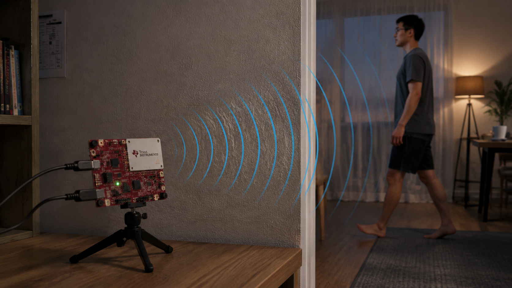

# RadarHPE-Toolbox

### The open entry point for mmWave radar Human Pose Estimation

**Learn the signal. Train the model. Benchmark fairly. Contribute your method.**

RadarHPE-Toolbox is a unified, physics-guided library for **millimetre-wave (mmWave) radar Human Pose Estimation (HPE)** — built so that newcomers can start in an afternoon, and so that the community can stop re-implementing data loaders and metrics for every new paper.

<p align="center">
  
  <br/>
  <em>Privacy-preserving · works in the dark · sees through soft obstacles · runs on low-cost TI boards</em>
</p>

[](LICENSE)
[](pyproject.toml)
[](https://pytorch.org/)
[](.github/workflows/ci.yml)
[](docs/MmWave_Fundamentals.md)
[](docs/Tutorials.md)

---

## Why mmWave — and why this toolbox matters

Cameras dominate human sensing research, but they break the moment privacy, darkness, occlusion, or cost become first-class constraints. **mmWave FMCW radar** is different:

| Challenge in the wild | What cameras struggle with | What mmWave offers |
|---|---|---|
| Privacy in homes / clinics / workplaces | Identity-rich RGB imagery | Geometric motion cues without faces or appearance |
| Darkness, glare, smoke, privacy curtains | Lighting-dependent | Illumination-invariant RF sensing |
| Soft occlusion (drywall, clothing, some furniture) | Line-of-sight only | Partial through-obstacle sensing |
| Edge / large-scale deployment | Costly multi-camera setups | Compact, commodity TI radar boards |

The scientific opportunity is real — but the **engineering barrier** has been too high. Each paper typically ships a standalone repo with its own radar tensor layout, training loop, and evaluation script. Beginners cannot learn the signal path; researchers cannot compare methods without rewriting glue code.

**RadarHPE-Toolbox exists to close that gap:** one package for fundamentals → datasets → models → metrics, with a plugin API so the community can grow a shared model zoo instead of a pile of one-off repositories.

> Packaging and developer experience are inspired by
> [IQA-PyTorch](https://github.com/chaofengc/IQA-PyTorch): registries, configs, and a short path from clone → first experiment.

---

## What you get today

<table>
<tr>
<td width="50%" valign="top">

### For beginners
- A primer on FMCW radar, heatmaps, and CFAR → point clouds  
  ([MmWave Fundamentals](docs/MmWave_Fundamentals.md))
- Runnable demos with **synthetic data** (no dataset download required)
- A single learning path: radar basics → dataset → train / eval

</td>
<td width="50%" valign="top">

### For researchers
- Shared loaders for HuPR / XRF55 / mmRadPose / MMVR
- Shared metrics: MPJPE, PA-MPJPE, MPJVE, AKV
- Registry-based model zoo + 5-minute plugin pattern
- Physics-guided baselines from recent papers (see below)

</td>
</tr>
</table>

**Unified baselines currently wired into the toolbox:**

- **[PULSE](https://github.com/DandongExpress/Doppler-Prompting-for-Stable-mmWave-based-Human-Pose-Estimation)** — Doppler Prompting for Stable mmWave-based HPE (ICML 2026)
- **[Agile-MmWave-Hpe](https://github.com/DandongExpress/Agile-MmWave-Hpe)** — physics-guided SSP/MCP/HMSF preprocessing for edge deployment (ICME 2026)
- **[PPPR](https://github.com/DandongExpress/PPPR)** — Person Parametric Physics-informed Representation (ACM IMWUT / UbiComp 2026)

> **Integration status.** `radarhpe.basics`, dataset loaders, metrics, registry, and CLI are usable today. Architecture wrappers expose the public APIs of the three papers; full tensor-level forward ports are tracked in [ModelCard.md](docs/ModelCard.md#integration-status).

---

## Installation

```bash
git clone https://github.com/DandongExpress/RadarHPE-Toolbox.git
cd RadarHPE-Toolbox
pip install -e .
```

Alternative: `pip install -r requirements.txt`. Once published: `pip install radarhpe`.

Requires **Python ≥ 3.8** and **PyTorch ≥ 1.13**. See `pyproject.toml` for the full dependency list (`dev` / `onnx` extras available).

---

## Quick start

### 1) Radar fundamentals (no trained model needed)

```python
from radarhpe.basics import (
    synthesize_hupr_frame, heatmap_to_pointcloud, plot_hupr_overview,
)

cube = synthesize_hupr_frame()          # or load a HuPR .npy heatmap
cloud, cfar = heatmap_to_pointcloud(cube)
plot_hupr_overview(cube, cloud=cloud, show=True)
```

```bash
python examples/demo_heatmap.py --save outputs/ra_rd.png
python examples/demo_cfar_pointcloud.py --save outputs/overview.png
```

### 2) Models, datasets, metrics

```python
import radarhpe

print(radarhpe.list_models())    # ['agile_hpe', 'pppr', 'pulse_1f', 'pulse_kf']
print(radarhpe.list_datasets())  # ['hupr', 'mmradpose', 'mmvr', 'xrf55']
print(radarhpe.list_metrics())   # ['akv', 'mpjpe', 'mpjve', 'pa_mpjpe']

model = radarhpe.create_model('pulse_1f', device='cpu')
```

```bash
python -m radarhpe.inference -m pulse_1f -r frame.npy --ckpt path/or/hf-hub-id
```

Full walkthrough: [docs/Tutorials.md](docs/Tutorials.md).

---

## Model zoo

| Model | Paper | Datasets | Key metrics |
|---|---|---|---|
| `pulse_1f` / `pulse_kf` | [Doppler Prompting…](https://arxiv.org/abs/2605.13233), ICML 2026 | HuPR, XRF55, mmRadPose | MPJPE, PA-MPJPE, MPJVE, AKV |
| `agile_hpe` | [Why Learn What Physics Already Knows?](https://arxiv.org/abs/2603.08236), ICME 2026 | HuPR | MAJPE, PA-MAJPE |
| `pppr` | [Person Parametric Physics-informed Representation](https://arxiv.org/abs/2512.23054), IMWUT/UbiComp 2026 | MMVR, HuPR, XRF55 | MPJPE, PA-MPJPE |

Details & checkpoints: [docs/ModelCard.md](docs/ModelCard.md).

---

## Datasets

One interface — `radarhpe.create_dataset(...)` — across:

- **HuPR** — TI IWR1843BOOST, single-person
- **XRF55** — TI IWR6843ISK, multi-person capable
- **mmRadPose** — mocap ground truth, single-person
- **MMVR** — TI AWR2243 (PPPR)

Layouts & licenses: [docs/Dataset_Preparation.md](docs/Dataset_Preparation.md).

---

## Learning path we recommend

```text
MmWave Fundamentals  →  heatmap / CFAR demos  →  load HuPR
        ↓
   create_model(...)  →  train.py / eval.py  →  plug in your method
```

1. [docs/MmWave_Fundamentals.md](docs/MmWave_Fundamentals.md) — chirps, RA/RD/RAD, CFAR  
2. `examples/demo_*.py` — see the data before you train  
3. [docs/Tutorials.md](docs/Tutorials.md) — datasets, training, evaluation  
4. [docs/Instruction.md](docs/Instruction.md) — add your model in ~5 minutes  

---

## Repository structure

```text
RadarHPE-Toolbox/
├── radarhpe/
│   ├── basics/          # mmWave fundamentals (I/O, CFAR, viz)
│   ├── archs/           # model zoo (registry-based)
│   ├── data/            # dataset loaders
│   ├── metrics/         # MPJPE / PA-MPJPE / MPJVE / AKV
│   └── utils/
├── examples/            # beginner heatmap / CFAR scripts
├── options/train|test/  # YAML configs
├── docs/                # fundamentals, tutorials, model card
├── tests/
├── train.py
└── eval.py
```

---

## Call for contributors

If you work on mmWave / RF human sensing, **we want your method in the zoo**.

Useful contributions include:

- porting a paper’s forward pass into `radarhpe/archs/`
- adding a dataset loader under `radarhpe/data/`
- improving CFAR / preprocessing / visualisation in `radarhpe.basics`
- tutorials, bug fixes, and evaluation scripts

Start with [docs/Instruction.md](docs/Instruction.md). Open an issue before a large PR so we can align on API shape. Stars, citations, and PRs all help this become a shared community resource — not another one-off paper repo.

---

## Updates

See [docs/history_changelog.md](docs/history_changelog.md).

---

## Citation

If you use this toolbox, please cite the paper(s) corresponding to the model(s) you use:

```bibtex
@article{zheng2026doppler,
  title={Doppler Prompting for Stable mmWave-based Human Pose Estimation},
  author={Zheng, Shuntian and Li, Jiaqi and Lu, Xiaoman and He, Shuai and Guan, Yu},
  journal={arXiv preprint arXiv:2605.13233},
  year={2026}
}

@article{zheng2026learn,
  title={Why Learn What Physics Already Knows? Realizing Agile mmWave-based Human Pose Estimation via Physics-Guided Preprocessing},
  author={Zheng, Shuntian and Li, Jiaqi and Ni, Minzhe and Lu, Xiaoman and Guan, Yu},
  journal={arXiv preprint arXiv:2603.08236},
  year={2026}
}

@article{zheng2025person,
  title={Person Parametric Physics-informed Representation for mmWave-based Human Pose Estimation},
  author={Zheng, Shuntian and Li, Jiaqi and Wang, Guangming and Ni, Minzhe and Palit, Arnad and Montana, Giovanni and Guan, Yu},
  journal={arXiv preprint arXiv:2512.23054},
  year={2025}
}
```

A `CITATION.cff` is also provided for GitHub’s “Cite this repository” button.

## License

Released under the [MIT License](LICENSE). Attribution for vendored / forthcoming ports is in [NOTICE](NOTICE).
